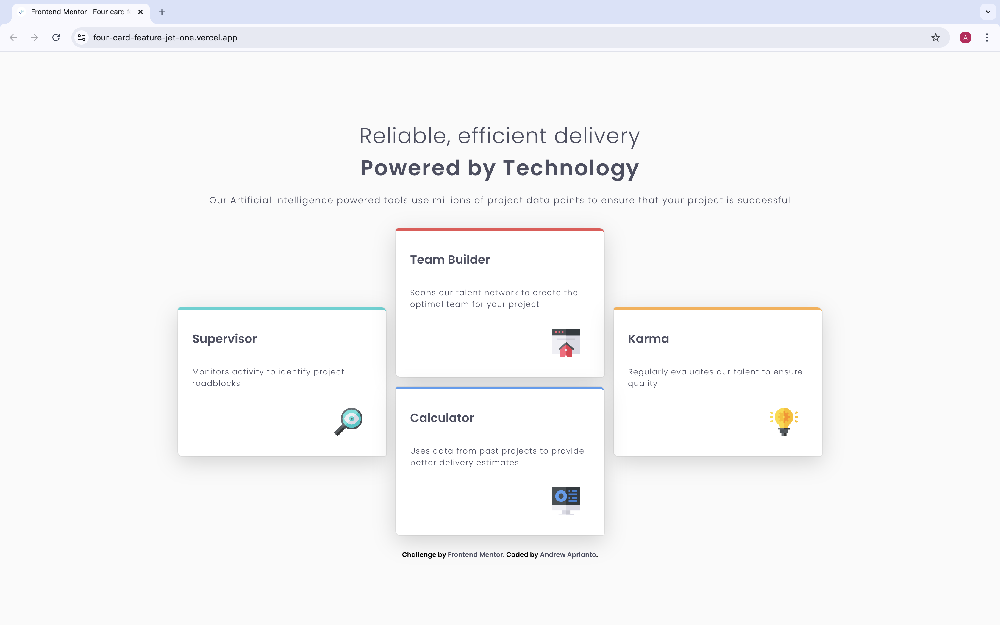
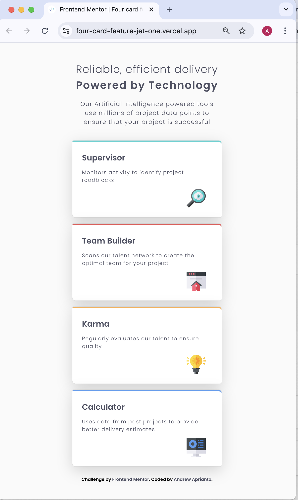

# Frontend Mentor - Four card feature section solution

This is a solution to the [Four card feature section challenge on Frontend Mentor](https://www.frontendmentor.io/challenges/four-card-feature-section-weK1eFYK). Frontend Mentor challenges help you improve your coding skills by building realistic projects.

## Table of contents

- [Overview](#overview)
  - [The challenge](#the-challenge)
  - [Screenshot](#screenshot)
  - [Links](#links)
- [My process](#my-process)
  - [Built with](#built-with)
  - [What I learned](#what-i-learned)
- [Author](#author)

## Overview

### The challenge

Users should be able to:

- View the optimal layout for the site depending on their device's screen size

### Screenshot

** Desktop **

** Mobile **

### Links

- Solution URL: [Github](https://github.com/meandrewaprianto/four-card-feature)
- Live Site URL: [Vercel](https://four-card-feature-jet-one.vercel.app/)

## My process

### Built with

- Semantic HTML5 markup
- CSS custom properties
- Flexbox
- CSS Grid
- Mobile-first workflow

### What I learned

CSS Grid, Transform from flexbox into CSS Grid with a help with media queries

## Author

- Frontend Mentor - [@meandrewaprianto](https://www.frontendmentor.io/profile/meandrewaprianto)
